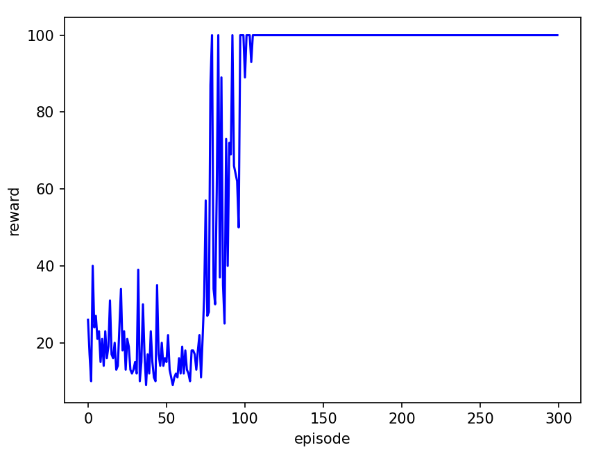
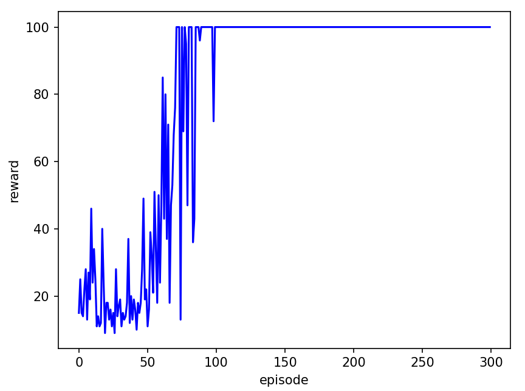
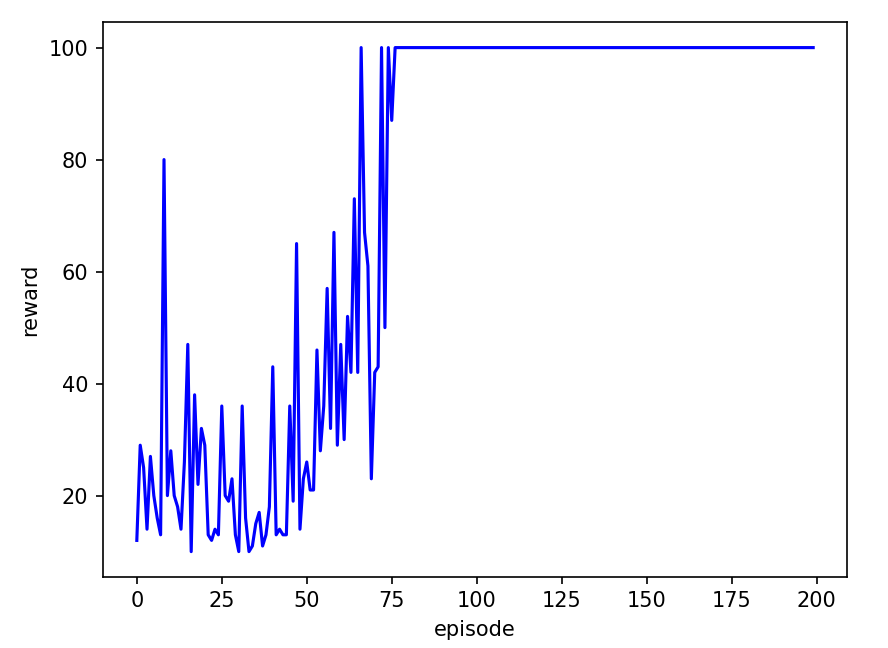
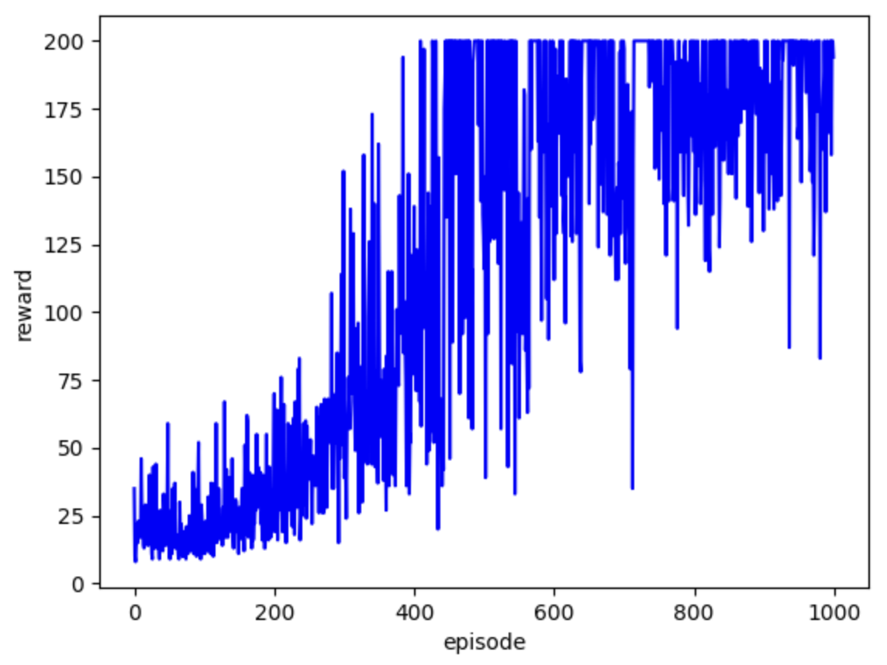
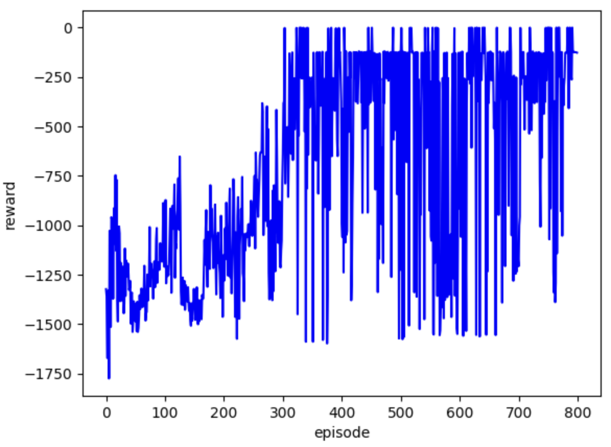

# _1.Introduction_
This repository provides implementations of common **Deep Reinforcement Learning** (DRL) algorithms.

If you have any questions about the code, feel free to submit an issue or contact me via _my email_ (available on [my homepage](https://github.com/cloudpetticoats)).

⚠️ <font color=#FF0000 >Important Note:</font>

All algorithms in this repository, except for 4.Noisy-DQN and 8.MADDPG, have been thoroughly tested and can be used with confidence. 😍

However, if you plan to use 4.Noisy-DQN or 8.MADDPG, please proceed with caution. 😐

### To do List
- ✅ [DQN](https://github.com/cloudpetticoats/deep-reinforcement-learning/tree/main/1.%20DQN) – Implementation & Testing
- ✅ [Double-DQN](https://github.com/cloudpetticoats/deep-reinforcement-learning/tree/main/2.%20Double-DQN) – Implementation & Testing
- ✅ [Dueling-DQN](https://github.com/cloudpetticoats/deep-reinforcement-learning/tree/main/3.%20Dueling-DQN) – Implementation & Testing
- ✅ [DDPG](https://github.com/cloudpetticoats/deep-reinforcement-learning/tree/main/5.%20DDPG) – Implementation & Testing
- ✅ [PPO-Discrete](https://github.com/cloudpetticoats/deep-reinforcement-learning/tree/main/6.%20PPO-Discrete) – Implementation & Testing
- ✅ [PPO-Continuous](https://github.com/cloudpetticoats/deep-reinforcement-learning/tree/main/7.%20PPO-Continuous) – Implementation & Testing
- 🔧 Noisy-DQN – Debugging
- 🔧 MADDPG – Debugging
- 🚧 SAC – Implementation in Progress
- 🚧 DSAC – Implementation in Progress

# _2.Usage_

It is super easy to use our DRL algorithms. If you just want to test the performance, please see [2.3](#23-for-testing). If you want to train the model yourself, please see [2.4](#24-for-training).

### 2.1 Download Repo Code
```
git clone https://github.com/cloudpetticoats/deep-reinforcement-learning.git
```

### 2.2 Configure the Environment

We are using common dependencies, so version issues are unlikely to occur. You can directly use your existing environment. Don't need the same version as me.

But if you encounter any environment issues, here is my environment for reference.
```
Python 3.9
PyTorch 2.6.0
Gym 0.26.2
Matplotlib 3.9.1
PettingZoo 1.24.3
```

### 2.3 For Testing

If you don't want to train the model yourself. In each algorithm, we have provided the trained model under `./models/` directory. You can run `test.py` directly for visualization testing.

### 2.4 For Training

If you want to train the model yourself. In each algorithm, run `main.py` to train, save the trained model to the `./models/` directory, and then run `test.py` to perform visualization testing. 

# _3.Performance_

We tested our code in the Gym, and some of the results are as follows.

<table style="width:100%; text-align:center;">
  <tr>
    <td style="vertical-align: top;">
      <div style="text-align: center;">
        <strong>CartPole-v1(DQN)</strong>
      </div>
      <div>
        
      </div>
    </td>
    <td style="vertical-align: top;">
      <div style="text-align: center;">
        <strong>CartPole-v1(Double-DQN)</strong>
      </div>
      <div>
        
      </div>
    </td>
    <td style="vertical-align: top;">
      <div style="text-align: center;">
        <strong>CartPole-v1(Dueling-DQN)</strong>
      </div>
      <div>
        
      </div>
    </td>
  </tr>
  <tr>
    <td style="vertical-align: top;">
      <div style="text-align: center;">
        <strong>Pendulum-v1(DDPG)</strong>
      </div>
      <div>
        
      </div>
    </td>
    <td style="vertical-align: top;">
      <div style="text-align: center;">
        <strong>CartPole-v0(PPO-Discrete)</strong>
      </div>
      <div>
        
      </div>
    </td>
    <td style="vertical-align: top;">
      <div style="text-align: center;">
        <strong>Pendulum-v1(PPO-Continuous)</strong>
      </div>
      <div>
        
      </div>
    </td>
  </tr>
</table>

# _4.Reference_
### 4.1 Excellent Weblog
- [How to choose a deep reinforcement learning algorithm? (MuZero, SAC, PPO, TD3, DDPG, DQN, etc.)](https://zhuanlan.zhihu.com/p/342919579)
- [Hyperparameter Tuning Techniques in Deep Reinforcement Learning: Examples from D3QN, TD3, PPO, and SAC Algorithms](https://zhuanlan.zhihu.com/p/345353294)
- [PPO Hyperparameter Tuning Tricks](https://zhuanlan.zhihu.com/p/512327050)
### 4.2 Excellent Web
- [Deep Reinforcement Learning Laboratory](https://www.deeprlhub.com/)
- [Mushroom Book](https://datawhalechina.github.io/easy-rl/#/)
- [hujian@gitbook](https://hujian.gitbook.io/deep-reinforcement-learning)
### 4.3 Excellent Course
- [Professor Hung-yi Lee's Deep Reinforcement Learning Online Course](https://www.youtube.com/watch?v=z95ZYgPgXOY&list=PLJV_el3uVTsODxQFgzMzPLa16h6B8kWM_&index=1)
