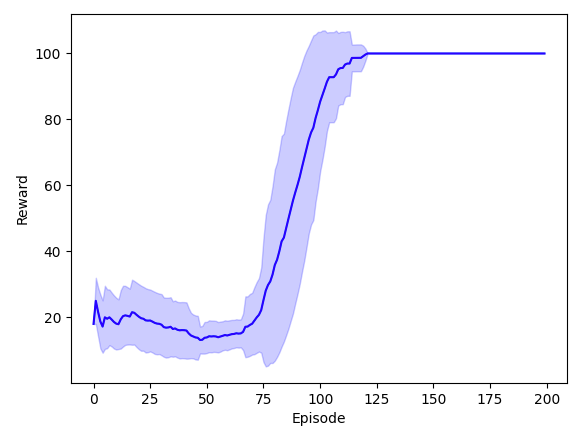
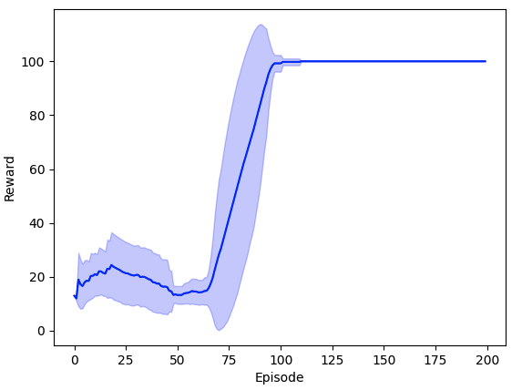
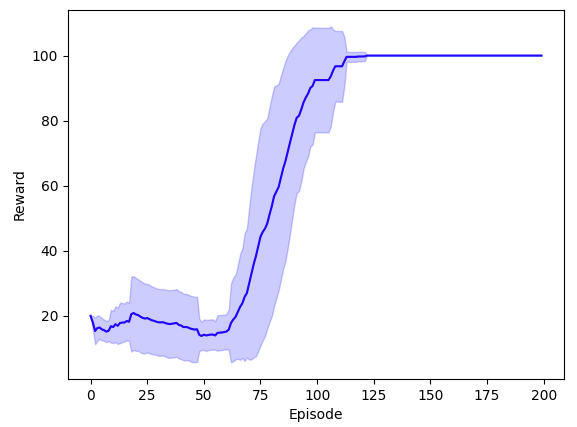
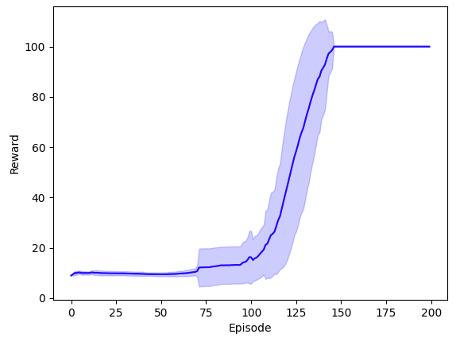
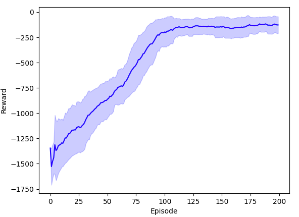
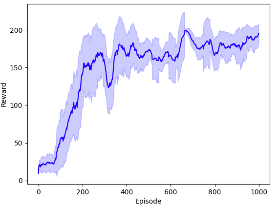
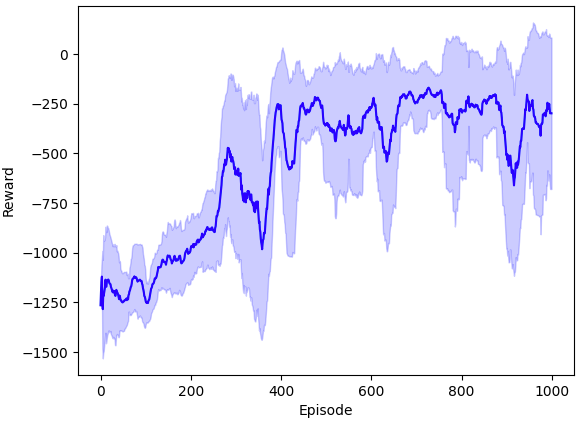
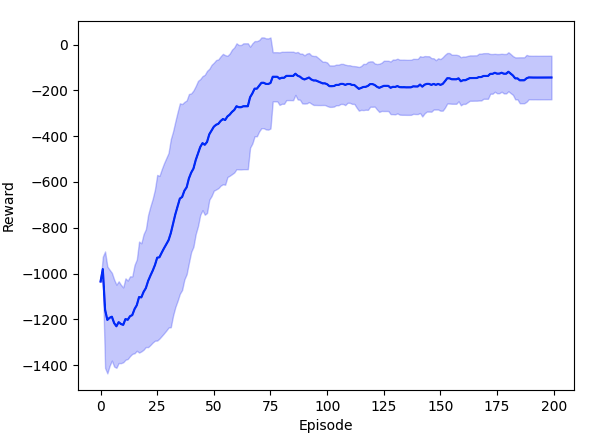

<div align=center>

</div>

<div align=center>
Minimal abstraction, Beginner-friendly
</div>

<div align=center>
  
  
  <a href="https://pytorch.org/"></a>
</div>

# _1.Introduction_
This repository provides **clean** and **robust** implementations of common **Deep Reinforcement Learning** (DRL) algorithms.

If you have any questions about the code, feel free to submit an issue or contact me via _my email_ (available on [my homepage](https://github.com/cloudpetticoats)).

### To do List
- ✅ [DQN](https://github.com/cloudpetticoats/deep-reinforcement-learning/tree/main/1.%20DQN) – Implementation complete
- ✅ [Double-DQN](https://github.com/cloudpetticoats/deep-reinforcement-learning/tree/main/2.%20Double-DQN) – Implementation complete
- ✅ [Dueling-DQN](https://github.com/cloudpetticoats/deep-reinforcement-learning/tree/main/3.%20Dueling-DQN) – Implementation complete
- ✅ [Noisy-DQN](https://github.com/cloudpetticoats/deep-reinforcement-learning/tree/main/4.%20Noisy-DQN) – Implementation complete
- ✅ [DDPG](https://github.com/cloudpetticoats/deep-reinforcement-learning/tree/main/5.%20DDPG) – Implementation complete
- ✅ [PPO-Discrete](https://github.com/cloudpetticoats/deep-reinforcement-learning/tree/main/6.%20PPO-Discrete) – Implementation complete
- ✅ [PPO-Continuous](https://github.com/cloudpetticoats/deep-reinforcement-learning/tree/main/7.%20PPO-Continuous) – Implementation complete
- ✅ [SAC](https://github.com/cloudpetticoats/deep-reinforcement-learning/tree/main/9.%20SAC) – Implementation complete
- 🚧 DSAC – In progress
- 🚧 MADDPG – In progress

# _2.Usage_

It is super easy to use our DRL algorithms. If you just want to test the performance, please see [2.3](#23-for-testing). If you want to train the model yourself, please see [2.4](#24-for-training).

### 2.1 Download Repo Code
```
git clone https://github.com/cloudpetticoats/deep-reinforcement-learning.git
```

### 2.2 Configure the Environment

We are using common dependencies, so version issues are unlikely to occur. You can directly use your existing environment. Don't need the same version as me.

But if you encounter any environment issues, here is my environment for reference.
```
Python 3.9
PyTorch 2.6.0
Gym 0.26.2
Matplotlib 3.9.1
```

### 2.3 For Testing

If you don't want to train the model yourself. In each algorithm, we have provided the trained model under `./models/` folder. You can run `test.py` directly for visualization testing.

### 2.4 For Training

If you want to train the model yourself. In each algorithm, run `main.py` to train, save the trained model to the `./models/` folder, and then run `test.py` to perform visualization testing. 

# _3.Performance_

We tested our code in the Gym, and the results are as follows.

<table style="width:100%; text-align:center;">
  <tr>
    <td style="vertical-align: top;">
      <div style="text-align: center;">
        <strong>CartPole-v1(DQN)</strong>
      </div>
      <div>
        
      </div>
    </td>
    <td style="vertical-align: top;">
      <div style="text-align: center;">
        <strong>CartPole-v1(Double-DQN)</strong>
      </div>
      <div>
        
      </div>
    </td>
    <td style="vertical-align: top;">
      <div style="text-align: center;">
        <strong>CartPole-v1(Dueling-DQN)</strong>
      </div>
      <div>
        
      </div>
    </td>
  </tr>
  <tr>
    <td style="vertical-align: top;">
      <div style="text-align: center;">
        <strong>CartPole-v1(Noisy-DQN)</strong>
      </div>
      <div>
        
      </div>
    </td>
    <td style="vertical-align: top;">
      <div style="text-align: center;">
        <strong>Pendulum-v1(DDPG)</strong>
      </div>
      <div>
        
      </div>
    </td>
    <td style="vertical-align: top;">
      <div style="text-align: center;">
        <strong>CartPole-v0(PPO-Discrete)</strong>
      </div>
      <div>
        
      </div>
    </td>
  </tr>
  <tr>
    <td style="vertical-align: top;">
      <div style="text-align: center;">
        <strong>Pendulum-v1(PPO-Continuous)</strong>
      </div>
      <div>
        
      </div>
    </td>    
    <td style="vertical-align: top;">
      <div style="text-align: center;">
        <strong>Pendulum-v1(SAC)</strong>
      </div>
      <div>
        
      </div>
    </td>

  </tr>
</table>

# _4.Reference_
### 4.1 Related Paper
- DQN: [Mnih, V., Kavukcuoglu, K., Silver, D. et al. Human-level control through deep reinforcement learning. Nature 518, 529–533 (2015).](https://www.nature.com/articles/nature14236?source=post_page)
- Double DQN: [van Hasselt, H., Guez, A. and Silver, D. Deep Reinforcement Learning with Double Q-Learning. Proceedings of the AAAI Conference on Artificial Intelligence. 30, 1 (Mar. 2016).](https://ojs.aaai.org/index.php/AAAI/article/view/10295)
- Dueling DQN: [Ziyu Wang, Tom Schaul, Matteo Hessel, Hado Van Hasselt, Marc Lanctot, and Nando De Freitas. Dueling network architectures for deep reinforcement learning. In Proceedings of the 33rd International Conference on International Conference on Machine Learning - Volume 48 (ICML).](https://dl.acm.org/doi/10.5555/3045390.3045601)
- Noisy DQN: [Fortunato M, Azar M G, Piot B, et al. Noisy networks for exploration. arXiv preprint arXiv:1706.10295, 2017.](https://arxiv.org/abs/1706.10295)
- DDPG: [Lillicrap T P, Hunt J J, Pritzel A, et al. Continuous control with deep reinforcement learning. arXiv preprint arXiv:1509.02971, 2015.](https://arxiv.org/abs/1509.02971)
- PPO: [Schulman J, Wolski F, Dhariwal P, et al. Proximal policy optimization algorithms. arXiv preprint arXiv:1707.06347, 2017.](https://arxiv.org/abs/1707.06347)
- SAC: [Haarnoja T, Zhou A, Abbeel P, et al. Soft actor-critic: Off-policy maximum entropy deep reinforcement learning with a stochastic actor. arXiv preprint arXiv:1801.01290, 2018.](https://arxiv.org/abs/1801.01290)
- DSAC-T: [J. Duan et al., "Distributional Soft Actor-Critic With Three Refinements," IEEE Transactions on Pattern Analysis and Machine Intelligence, doi: 10.1109/TPAMI.2025.3537087](https://ieeexplore.ieee.org/abstract/document/10858686)
### 4.2 Excellent Weblog
- [How to choose a deep reinforcement learning algorithm? (MuZero, SAC, PPO, TD3, DDPG, DQN, etc.)](https://zhuanlan.zhihu.com/p/342919579)
- [Hyperparameter Tuning Techniques in Deep Reinforcement Learning: Examples from D3QN, TD3, PPO, and SAC Algorithms](https://zhuanlan.zhihu.com/p/345353294)
- [PPO implementation tricks](https://zhuanlan.zhihu.com/p/512327050)
### 4.3 Excellent Web
- [Deep Reinforcement Learning Laboratory](https://www.deeprlhub.com/)
- [Mushroom Book](https://datawhalechina.github.io/easy-rl/#/)
- [hujian@gitbook](https://hujian.gitbook.io/deep-reinforcement-learning)
### 4.4 Excellent Course
- [Professor Hung-yi Lee's Deep Reinforcement Learning Online Course](https://www.youtube.com/watch?v=z95ZYgPgXOY&list=PLJV_el3uVTsODxQFgzMzPLa16h6B8kWM_&index=1)

