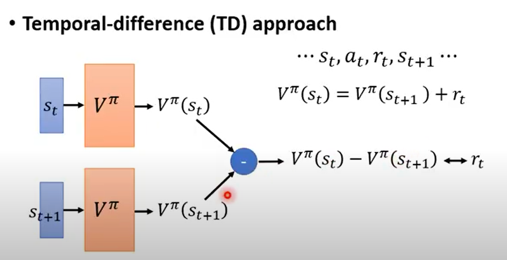
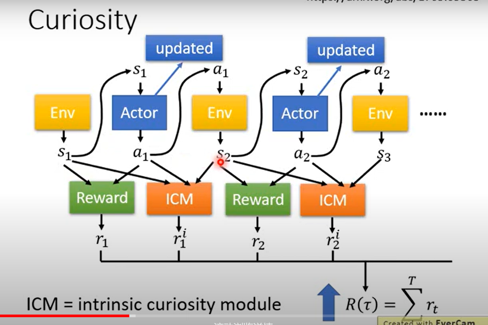

# _1.Introduction_
This repository is an implementation of common algorithms for **Deep Reinforcement Learning (DRL)**. 

In each directory, run `main.py` to train, save the trained model to the `./models/` directory, and then run `test.py` to perform visualization tests. 

For code questions, please submit an issue or contact via _email_ (my homepage shows).

# _2.Reference_
* Excellent Weblog：
    + [如何选择深度强化学习算法？MuZero/SAC/PPO/TD3/DDPG/DQN/等](https://zhuanlan.zhihu.com/p/342919579)
    + [深度强化学习调参技巧：以D3QN、TD3、PPO、SAC算法为例](https://zhuanlan.zhihu.com/p/345353294)
* Excellent Web：
    + [深度强化学习实验室](https://www.deeprlhub.com/)
    + [蘑菇书](https://datawhalechina.github.io/easy-rl/#/)
    + [hujian@gitbook](https://hujian.gitbook.io/deep-reinforcement-learning)
* Excellent Course：
    + [李宏毅深度强化学习公开课YouTube](https://www.youtube.com/watch?v=z95ZYgPgXOY&list=PLJV_el3uVTsODxQFgzMzPLa16h6B8kWM_&index=1)

# _3.The algorithm included in this project(Notes)_
* **DDPG**
  + Add a baseline: Make the total reward when updating an actor have a positive or negative number. And not always positive.(因为随机sample样本训练，可能抽到不好的action去训练，并且这个action的reward又是正数，导致这个action概率增大~)
   
  + Assign Suitable Credit(就是在baseline的基础上再加一个衰减因子gamma作为后面梯度的权重系数): A `gamma` has been added, which means that the farther away from the current state of the action is made, the smaller the weight of the reward to the current one. `b` is generated through a network and is somewhat complex. The `Advantage Function` is the critic of Actor-Critic.
   
  + On-policy / Off-policy: agent自己在environment中交互并更新policy / agent使用其它agent交互出来的经验更新自己的policy.
* **PPO**
  + 
  + 参考的[code](https://github.com/LiSir-HIT/Reinforcement-Learning/blob/main/Model/7.%20PPO_Continuous/RL_brain.py)，不知道对不对，现在我实现的不收敛，以后再解决吧~
  + Important Sampling: (是一个普遍的方法，不是RL独有的)核心思想就是我们无法求出p分布下f(x)的期望，但可以通过求q分布下f(x)的期望去代替。但需要大量的sample，过少的sample会出现二者不相等的情况.
   
* **DQN**
  + value-based方法使用Temporal-difference(TD)更新network.(`V(St)`的含义是从当前状态St开始到这个episode结束所能获得奖励的期望)
   
  + Q:和V不一样，输入的是a和s，代表的是在状态s执行动作a之后可以获得的未来奖励值的期望。V只输入s。
   
  + 使用target network在更新网络的时候只更新原始网络，固定target，在训练一定轮数后再把target网络的参数更新。
   
  + Exploration:agent需要有一定的探索性，如果一直根据`Q Function`的最大值去选择action就会导致有一些action一直不能被选择到，为了训练每个state下更多的action，需要增加一些agent的探索性。主要有下图所示的两种解决方案。
   
  + replay buffer
  + DQN-Algorithm
   
  + prioritized replay: 把q和q_target之间差距更大的设置更高的优先级去sample.(注意不是奖励越大的设置更高的优先级，而是TD-error越大的~)
   
  + multi-step:原始的思想是经验只存一步的reward，multi-step的思想是存多步的reward，是一种MC和TD结合的思想。
   
  + noisy net:
   
  + distributional q-function
  + rainbow:把上述所有方法组合到一起(下图第一张为在DQN基础上单独加上每一种改进的效果，第二张图为在rainbow的基础上单独剪掉某一种方法的效果)。
   
   
  + DQN处理连续的action空间也是可以的，有三种解决办法。第一种：大数定律穷举多个样本，取最大q值的action；第二种：使用梯度上升选取action优化q最大，太费时间；第三种：定义一个非常好求最值的q函数，在这个函数下a=μ是就是最值所在点。
   
   
* **Double-DQN**
  + 在DQN的基础上只有一个改动：DQN是target_q_net选取下一状态的最大值动作，然后算出它的Q值（这种思想会出现**高估**问题）。Double-DQN是使用q_net选择最大值的动作，然后使用target_q_net计算Q值。
* **Dueling-DQN**
  + 在DQN的基础上值改变的网络的结构，输出位置是由两个结果加起来的。并且需要给输出矢量那个部分加上个约束，例如令矢量里面的元素之和始终等于0的normalize(下图上半部分是DQN网络架构，下半部分是Dueling-DQN网络架构)
   
  + 具体细节
   
* **Dueling Double Deep Q Network(D3QN)**
  + 就是把Double DQN和Dueling DQN结合起来。
# _4.Sparse Reward_
   
   