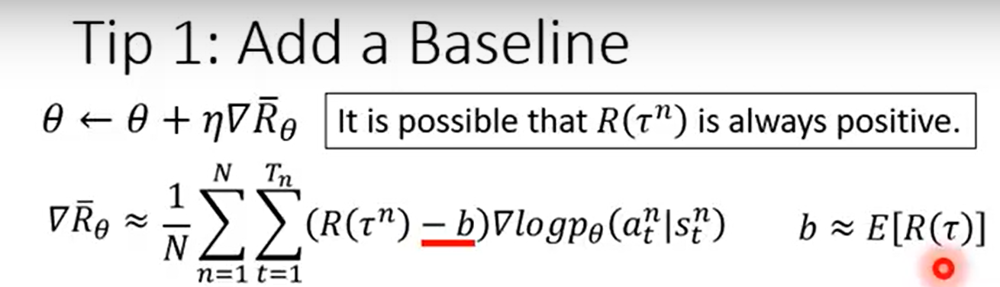

# _1.Introduction_
Code implementation of deep reinforcement learning

# _2.Reference_
* Excellent Weblog：https://zhuanlan.zhihu.com/p/342919579
* Excellent Web：https://www.deeprlhub.com/
* Excellent Course：https://www.youtube.com/watch?v=z95ZYgPgXOY&list=PLJV_el3uVTsODxQFgzMzPLa16h6B8kWM_&index=1

# _3.Tips_
* _Add a baseline:_ Make the total reward when updating an actor have a positive or negative number. And not always positive.(因为随机sample样本训练，可能抽到不好的action去训练，并且这个action的reward又是正数，导致这个action概率增大~)

* _Assign Suitable Credit(就是在baseline的基础上再加一个衰减因子gamma作为后面梯度的权重系数):_ A `gamma` has been added, which means that the farther away from the current state of the action is made, the smaller the weight of the reward to the current one.
`b` is generated through a network and is somewhat complex.
The `Advantage Function` is the critic of Actor-Critic.

* _On-policy / Off-policy:_ agent自己在environment中交互并更新policy / agent使用其它agent交互出来的经验更新自己的policy.
* _Important Sampling:_ (是一个普遍的方法，不是RL独有的)核心思想就是我们无法求出p分布下f(x)的期望，但可以通过求q分布下f(x)的期望去代替。但需要大量的sample，过少的sample会出现二者不相等的情况.

# _4.The algorithm included in this project_
* DDPG
* PPO

