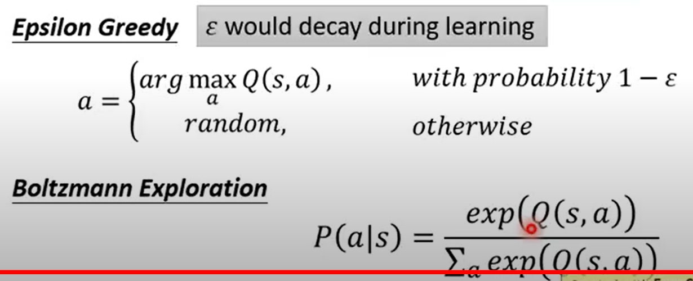

# _1.Introduction_
Code implementation of deep reinforcement learning

# _2.Reference_
* Excellent Weblog：
    + https://zhuanlan.zhihu.com/p/342919579
* Excellent Web：
    + 深度强化学习实验室：https://www.deeprlhub.com/
    + 蘑菇书：https://datawhalechina.github.io/easy-rl/#/
* Excellent Course：
    + 李宏毅深度强化学习公开课：https://www.youtube.com/watch?v=z95ZYgPgXOY&list=PLJV_el3uVTsODxQFgzMzPLa16h6B8kWM_&index=1

# _3.Tips_
* _Add a baseline:_ Make the total reward when updating an actor have a positive or negative number. And not always positive.(因为随机sample样本训练，可能抽到不好的action去训练，并且这个action的reward又是正数，导致这个action概率增大~)

* _Assign Suitable Credit(就是在baseline的基础上再加一个衰减因子gamma作为后面梯度的权重系数):_ A `gamma` has been added, which means that the farther away from the current state of the action is made, the smaller the weight of the reward to the current one.
`b` is generated through a network and is somewhat complex.
The `Advantage Function` is the critic of Actor-Critic.

* _On-policy / Off-policy:_ agent自己在environment中交互并更新policy / agent使用其它agent交互出来的经验更新自己的policy.
* _Important Sampling:_ (是一个普遍的方法，不是RL独有的)核心思想就是我们无法求出p分布下f(x)的期望，但可以通过求q分布下f(x)的期望去代替。但需要大量的sample，过少的sample会出现二者不相等的情况.

# _4.The algorithm included in this project_
* DDPG
* PPO 
  + 
* DQN
  + value-based方法使用Temporal-difference(TD)更新network.(`V(St)`的含义是从当前状态St开始到这个episode结束所能获得奖励的期望)
   
  + Q:和V不一样，输入的是a和s，代表的是在状态s执行动作a之后可以获得的未来奖励值的期望。V只输入s。
   
  + 使用target network在更新网络的时候只更新原始网络，固定target，在训练一定轮数后再把target网络的参数更新。
   
  + Exploration:agent需要有一定的探索性，如果一直根据`Q Function`的最大值去选择action就会导致有一些action一直不能被选择到，为了训练每个state下更多的action，需要增加一些agent的探索性。主要有下图所示的两种解决方案。
   
  + replay buffer
  + DQN-Algorithm
   
* Double-DQN
  + 在DQN的基础上只有一个改动：DQN是target_q_net选取下一状态的最大值动作，然后算出它的Q值（这种思想会出现**高估**问题）。Double-DQN是使用q_net选择最大值的动作，然后使用target_q_net计算Q值。
* Dueling-DQN
  + 在DQN的基础上值改变的网络的结构，输出位置是由两个结果加起来的。并且需要给输出矢量那个部分加上个约束，例如令矢量里面的元素之和始终等于0的normalize(下图上半部分是DQN网络架构，下半部分是Dueling-DQN网络架构)
   
  + 具体细节
   